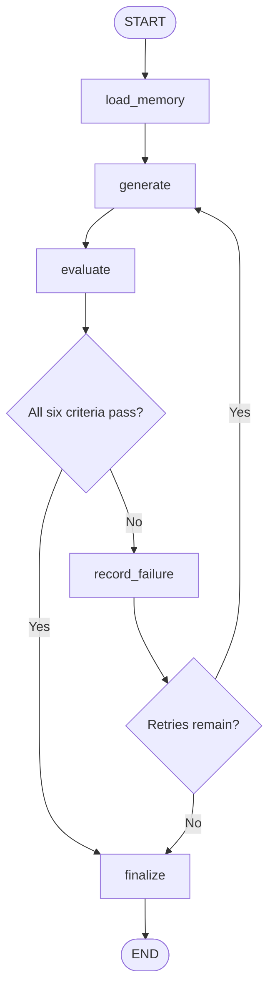

# Self-Evaluating Lesson Content Generator

A compact LangGraph application that generates a beginner lesson, evaluates six quality
criteria with a structured LLM judge, accepts or rejects the lesson in deterministic Python,
and revises rejected content with the judge's evidence. The submission topic defaults to
**Introduction to RAG** (Retrieval-Augmented Generation).

## Problem

A strong lesson-generation prompt can still produce omissions, unclear teaching, or factual
errors. A production-minded content system therefore needs an explicit quality gate instead of
assuming that one model response is ready to publish.

## Assessment Objective

This repository demonstrates a real finite agentic loop:

`GENERATE → EVALUATE → DECIDE → REGENERATE`

The model makes bounded semantic judgments. Application code owns acceptance, retry limits,
persistence, and termination. The content generator teaches RAG; the application itself does not
build an unrelated RAG retrieval stack.

## Solution Overview

- LangGraph makes nodes, state, conditional edges, and the feedback loop explicit.
- One generator model writes a standalone lesson for the target learner.
- An independent evaluator returns six Pydantic-validated hard PASS/FAIL results.
- `LessonEvaluation.overall_pass` calculates `all(criterion.passed)` in Python.
- Any failed criterion becomes a rejection record and focused revision instruction.
- Attempt 1 can be followed by at most two retries (three attempts total).
- SQLite preserves failure evidence across runs and derives bounded future guidance.
- Every run saves readable lesson, evaluation, rejection, and summary artifacts.
- `--inject-error` changes attempt-1 content only; it never forces an evaluator result.

## Architecture

This diagram matches the compiled graph in
[`src/lesson_generator/graph.py`](src/lesson_generator/graph.py).



The implementation uses LangGraph's `StateGraph`, `START`, `END`, and conditional edges. That
keeps the loop directly inspectable and makes deterministic routing testable independently of a
model call. See the [LangGraph Graph API documentation](https://docs.langchain.com/oss/python/langgraph/graph-api).

## Why LangGraph

The task is a stateful cyclic workflow, not a chat wrapper. LangGraph is useful here because it
expresses the feedback edge and exit conditions as executable graph structure. It also avoids
inventing unnecessary classes called “agents”: the agentic behavior is the evaluated revision
loop itself.

## State Design

`LessonState` is an explicit `TypedDict`. Nodes return visible state updates.

| Field | Purpose |
|---|---|
| `run_id`, `topic`, `learner_profile` | Run identity and trusted application inputs |
| `current_lesson`, `current_evaluation` | Latest draft and structured judgment |
| `attempt_number`, `retry_count`, `max_retries` | Deterministic retry bookkeeping |
| `evaluation_history` | Append-only snapshots of every draft and evaluation |
| `rejection_log` | One auditable record per failed criterion |
| `revision_feedback` | Focused feedback supplied to the next generation |
| `memory_context` | Cross-run, evidence-derived prompt guidance |
| `demo_mode` | Enables content injection on attempt 1 only |
| `final_status`, `artifact_paths`, `trace` | Outcome, persisted files, and node transitions |

## Generation Node

The generator receives the learner profile, required concepts, prior evaluator feedback, and
bounded memory guidance. The topic is placed inside a clearly delimited user-data section rather
than trusted system instructions. The prompt asks for simple English, progressive explanations,
an end-to-end example, comparisons with training/fine-tuning, and candid limitations.

On a retry, the previous draft appears in `<previous_lesson>` and its failed reasons, evidence,
and required corrections appear in `<revision_feedback>`. A test asserts that both the draft and
feedback reach the next generation call.

## Evaluator

The evaluator is separate from the generator prompt and receives no claim that a lesson is
“improved” or should pass. It judges the actual lesson against rubric version `1.1.0` and returns a
`LessonEvaluation` Pydantic object. Extra fields are forbidden, reasons cannot be empty, and every
failed result must contain actionable improvement feedback.

The production provider uses
`ChatGoogleGenerativeAI.with_structured_output(..., method="json_schema")`, the documented native
structured-output path for the Gemini integration. See the
[ChatGoogleGenerativeAI integration documentation](https://docs.langchain.com/oss/python/integrations/chat/google_generative_ai)
and [Gemini structured-output documentation](https://ai.google.dev/gemini-api/docs/structured-output).

### Hybrid validation

Semantic quality remains the judge model's responsibility. Two narrow objective checks stay in
application code:

- empty content fails immediately without wasting an evaluator call;
- a draft under 500 characters cannot pass essential concept coverage.

There is deliberately no keyword-count score pretending to measure accuracy or teaching quality.

## Rubric

The full, versioned rubric lives in [`src/lesson_generator/rubric.py`](src/lesson_generator/rubric.py).

| Criterion | PASS requirement | Common FAIL examples |
|---|---|---|
| Technical accuracy | Correct pipeline; retrieval differs from training/fine-tuning; no truth or privacy guarantee | Says retrieval changes weights, embeddings are summaries, or RAG itself guarantees truth/privacy |
| Beginner friendliness | Assumes no RAG background and uses accessible, direct explanations | Dense academic language or unexplained prerequisites |
| Teaches by example | One scenario connects query, retrieval, context, and answer | Merely mentions an example without using it to teach the mechanism |
| Jargon clarity | Explains LLM, retrieval, chunks, embeddings, context, and vector/similarity search | Relies on important terms before defining them |
| Key concept coverage | Covers motivation, documents, pipeline, training comparison, benefits, and all required limits | Omits a pipeline stage or a required limitation |
| Teaching flow | Motivation → definitions → pipeline → example → comparisons → limitations → recap | Fragmented order, repetition, or unexplained dependencies |

## Deterministic Acceptance

The evaluator model does **not** return or control the overall decision:

```python
@property
def overall_pass(self) -> bool:
    return all(result.passed for _, result in self.iter_criteria())
```

The graph's route function reads that computed property. A persuasive lesson cannot instruct the
application to stop, and a judge cannot average away a failed checkpoint.

## Generate → Evaluate → Regenerate Loop

1. Load persistent guidance.
2. Generate attempt `n`.
3. Obtain and validate six evaluator results.
4. Append the draft and judgment to evaluation history.
5. Finalize immediately only if all six pass.
6. Otherwise, append one rejection per failed criterion and write those events to SQLite.
7. Build focused feedback from reason, evidence, and improvement.
8. Regenerate if the deterministic attempt bound allows it; otherwise finalize as failed.

## Retry and Termination Guarantees

`attempt_number` starts at 0 and increments only in `generate`. `retry_count` is always
`attempt_number - 1`. With the default `max_retries=2`, failure after attempts 1 and 2 routes back
to generation; failure after attempt 3 routes to finalization.

The model never decides whether retries remain. The graph also receives a finite recursion limit
as a second safety boundary. Exhaustion produces exactly:

`FINAL STATUS: FAILED_AFTER_MAX_RETRIES`

The latest available lesson is saved without false approval.

## Rejection Log

Each failed criterion records the run ID, topic, attempt, criterion, reason, evidence, recommended
correction, demo marker, and UTC timestamp. Logs are written as formatted JSON. Evaluation history
also contains the complete lesson for every attempt, so revisions are auditable.

## Persistent Memory

[`src/lesson_generator/memory.py`](src/lesson_generator/memory.py) stores append-only failure events
in SQLite. On the next run, it groups recurring real-run failures by criterion, retrieves the most
recent reason, and combines that evidence with a fixed criterion-specific guidance template. Up to
three high-priority guidance items are injected into the next generator prompt.

This is genuine read/write memory: tests reopen the database in a new repository instance and
verify that derived guidance reaches the model prompt. Artificial demo failures remain stored for
auditability but are excluded from adaptation, so a presentation does not poison future behavior.

## Bounded Self-Evolution

We constrain self-evolution to evidence-based adaptive guidance generated from observed failure
patterns instead of allowing unrestricted autonomous prompt rewriting. This preserves
auditability, reproducibility, and protection against prompt drift.

The model cannot rewrite source code, system prompts, security boundaries, or the base rubric.
Guidance templates and the rubric are version-controlled; only observed failure rows accumulate.

## Deliberate Error Demonstration

```powershell
.\.venv\Scripts\python.exe demo.py --topic "Introduction to RAG" --inject-error
```

In demo mode, `LessonGenerator` appends exactly one deliberate misconception to attempt 1:
normal RAG is falsely described as permanently changing model weights with retrieved documents.
The evaluator is given only the resulting lesson and the normal rubric. It receives no demo flag,
and there is no `if inject_error: FAIL` branch. If technical accuracy fails, the normal rejection,
feedback, retry, and evaluation path runs. Injection is impossible after attempt 1 and impossible
in normal mode.

The deterministic test uses a semantic test double to prove the content traverses the same
evaluator interface twice and that the false sentence is absent from attempt 2. A live judge's
ability to catch it must still be validated with your configured API model before recording Loom.

## Project Structure

```text
.
├── demo.py
├── pyproject.toml
├── .env.example
├── README.md
├── data/                         # ignored runtime SQLite database
├── outputs/                      # ignored latest and run-scoped artifacts
├── docs/
│   ├── INTERVIEWER_AUDIT.md
│   └── LOOM_WALKTHROUGH.md
├── src/lesson_generator/
│   ├── cli.py                    # CLI and terminal observability
│   ├── config.py                 # centralized model/runtime configuration
│   ├── evaluator.py              # semantic judge + narrow deterministic checks
│   ├── generator.py              # generation + isolated demo injection
│   ├── graph.py                  # nodes, edges, routing, finite loop
│   ├── memory.py                 # SQLite cross-run failure patterns
│   ├── persistence.py            # atomic latest/run-scoped artifacts
│   ├── prompts.py                # separated, versioned prompts
│   ├── provider.py               # shared Gemini provider boundary
│   ├── rubric.py                 # explicit hard-pass rubric v1.1.0
│   ├── schemas.py                # Pydantic domain models
│   └── state.py                  # typed graph state
└── tests/
    ├── helpers.py
    ├── test_configuration.py
    ├── test_memory.py
    ├── test_routing.py
    ├── test_schemas_and_evaluator.py
    └── test_workflow.py
```

## Installation

Python 3.11–3.14 is supported. With `uv`:

```powershell
uv sync --extra dev
.\.venv\Scripts\python.exe --version
```

Or with standard Python:

```powershell
python -m venv .venv
.\.venv\Scripts\Activate.ps1
python -m pip install -e ".[dev]"
```

## Environment Setup

Create or view your own key in
[Google AI Studio](https://aistudio.google.com/app/apikey). A key belongs to your Google Cloud
project; never use a key copied from another person or a public website.

```powershell
Copy-Item .env.example .env
```

Edit `.env` and replace the placeholder:

```dotenv
GOOGLE_API_KEY=your-real-key
GEMINI_MODEL=gemini-3.7-flash
```

`.env`, the generated SQLite database, and rewritable stable outputs are ignored. The two audited
v1.1.0 run snapshots are intentionally retained for submission evidence; later run directories
remain ignored unless deliberately selected. No credential is printed or persisted. The model,
request timeout, provider retry count, workflow retry count, and paths are centralized in
`Settings`.

The selected Gemini model currently has free input and output tokens within the Free Tier's rate
limits. Free-tier availability and limits can change, and Google states that free-tier content may
be used to improve its products. Review the current
[Gemini API pricing page](https://ai.google.dev/gemini-api/docs/pricing) before running.

## Running the Workflow

```powershell
.\.venv\Scripts\python.exe demo.py --topic "Introduction to RAG"
```

The topic argument is optional because `Introduction to RAG` is the default.

## Running Demo Mode

```powershell
.\.venv\Scripts\python.exe demo.py --topic "Introduction to RAG" --inject-error
```

Run this once before recording. Judge models are probabilistic: if the configured model does not
reject the explicit misconception, inspect the saved evaluation rather than claiming success. Do
not silently switch to a paid model; select another free-tier model through `GEMINI_MODEL` only
after checking the current pricing page.

### Free-tier quota errors

`429 RESOURCE_EXHAUSTED` means the configured model's free request quota is temporarily exhausted;
it is not a workflow failure. Check [Google AI Studio usage](https://ai.dev/rate-limit), wait for
the displayed reset, and rerun. Repeated immediate retries consume time but cannot increase the
quota. The application deliberately has no automatic paid-model fallback.

## Running Tests

```powershell
.\.venv\Scripts\python.exe -m pytest
.\.venv\Scripts\ruff.exe check demo.py src tests
.\.venv\Scripts\python.exe -m compileall -q demo.py src tests
```

The deterministic suite uses no paid API calls. It covers schema validation, PASS/FAIL
representation, deterministic aggregation and routing, retry accounting and exhaustion, history
and rejection preservation, feedback propagation, SQLite read/write memory, guidance injection,
demo isolation and evaluator traversal, missing credentials, malformed structured output, empty
and undersized lessons, artifact persistence, and finite termination.

Pytest is configured to use the project-local ignored directory `.pytest-tmp/` and to disable its
optional cache. This avoids Windows ACL conflicts with a stale `%TEMP%\pytest-of-<user>` directory
and does not change test behavior.

## Generated Outputs

Every completed run writes stable latest-run files:

- `outputs/final_lesson.md`
- `outputs/evaluation_history.json`
- `outputs/rejection_log.json`
- `outputs/run_summary.json`

The same four files are also preserved under `outputs/runs/<run_id>/`, avoiding destructive loss
of earlier evidence while keeping the demonstration paths convenient.

## Verified Execution

A locally configured Gemini free-tier key was used for genuine end-to-end verification on
4 September 2026. The current default is `gemini-3.7-flash`; Google lists its Free Tier input and
output as free of charge, and it supports the native structured output used by the evaluator.
Verified runs include:

- normal run `4697a65785824f4e882c2a3dbe162090` on the previous 3.6 default: all six criteria
  passed on attempt 1;
- deliberate-error run `7ddc690631ec447d927877512bb592de` on the current 3.7 default:
  Technical Accuracy failed on
  attempt 1 because the injected sentence falsely claimed that retrieval changes model weights;
  evaluator feedback drove attempt 2, where all six criteria passed.

The stable files in `outputs/` contain the current deliberate-error result, while immutable run
snapshots remain under `outputs/runs/`. Earlier 3.6 calls also demonstrated both successful runs
and temporary `503 UNAVAILABLE`/`429 RESOURCE_EXHAUSTED` provider conditions; no paid fallback was
used.

The following is genuine deterministic-suite output from the same date:

```text
........................                                                 [100%]
24 passed in 0.83s
```

Before the key was configured, the CLI's missing-credential guard was independently verified:

```text
Self-Evaluating Lesson Content Generator
Topic: Introduction to RAG
Mode: NORMAL

ERROR: GOOGLE_API_KEY is not configured. Create a free-tier Gemini API key in
Google AI Studio, copy .env.example to .env, and add the key.
```

## Design Decisions

- **Structured output over free-form parsing:** schema failures become explicit developer errors.
- **Independent evaluator:** generation instructions cannot award their own approval.
- **Deterministic control:** Python aggregates criteria and owns both graph branches.
- **Bounded retries:** quality failures cannot create an infinite loop or runaway cost.
- **SQLite over a vector database:** the memory is small, structured, local, queryable, and easy
  to explain.
- **Bounded adaptation:** recurring evidence changes guidance, never executable code or rubrics.
- **Run-scoped plus stable artifacts:** reproducibility and a convenient Loom demonstration coexist.
- **CLI over frontend:** all assessment behavior stays visible without unrelated UI complexity.
- **One provider:** generator and evaluator initialization is centralized, while a small protocol
  keeps deterministic testing straightforward.

## Robustness

- missing credentials fail before provider construction;
- provider timeouts and transient retries are configured centrally;
- empty generations and provider errors produce useful exceptions;
- malformed evaluator output cannot silently pass;
- persistence failures are surfaced rather than swallowed;
- every failed criterion requires actionable feedback;
- retry exhaustion is an explicit non-passing status;
- prompt boundaries treat topic and lesson text as untrusted data.

## Limitations

- LLM-as-judge quality is model-dependent and can be inconsistent.
- No human-labelled evaluation set has calibrated false-pass/false-fail rates.
- A 500-character minimum detects gross incompleteness, not educational quality.
- SQLite is suitable for this single-process assessment, not concurrent distributed workers.
- The default model may need adjustment for account availability, quality, latency, or cost.
- Gemini Free Tier has rate limits and can return temporary capacity errors; rerun later rather
  than silently switching to a paid model.

## Production Improvements

Reasonable next steps—but intentionally **not implemented**—include a human-labelled calibration
dataset, judge ensembles, adversarial lessons, offline prompt-regression evaluation, explicit
prompt/rubric migrations, LangSmith-style tracing, token/cost/latency metrics, content versioning,
human-review escalation, CI quality gates, and richer learner personalization.
